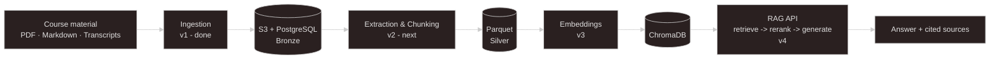

# project3-kms - A Knowledge Management System 

## 1. Problem & Approach
Data engineering students face scattered course material - unindexed slides, markdown repos, hours of video transcripts. Generic LLM tools hallucinate freely and have no awareness of a specific curriculum's actual content.

`project3-kms` is a Retrieval-Augmented Generation (RAG) knowledge system being built over a real corpus - PDFs, markdown, and 53 video transcripts from a data engineering program (STI, DE25), organized through a **medallion-layered pipeline** (`Bronze` -> `Silver` -> `Gold`). **The design goal**: every answer traces back to its exact source chunk, not a plausible-sounding guess.

Built as a **thesis project**, staged across six MVPs - ingestion and metadata are complete (MVP v1); extraction, embeddings, and a source-cited retrieve -> rerank -> generate API follow through MVP v4, with a bounded self-correction loop (MVP v4.5) and production deployment beyond that.

## 2. Tech Stack

| Layer | Built (MVP v1) | Planned |
|---|---|---|
| **Ingestion** | `Python 3.12`, `boto3`, `SQLAlchemy 2.0`, `Alembic`, `psycopg3` | - |
| **Storage** | `PostgreSQL`, `LocalStack S3 (dev)` | `Parquet (Silver)`, `ChromaDB (vectors)` |
| **AI layer** | - | `Grunden.ai, bge-m3 embeddings, bge-reranker-v2-m3, glm-5.2` |
| **Serving** | - | `FastAPI` |
| **Orchestration** | - | `Airflow`, `dbt` + `DuckDB` |
| Ops | `Docker Compose`, `GitHub Actions CI`, `pytest (20 tests)`, `Ruff` | `Reverse proxy` + `TLS`, `CD` |

## 3. Key Decisions

- **ChromaDB over Qdrant.** The corpus (53 transcripts + a modest PDF set) is well under the scale that justifies a dedicated vector database service. Already proven in an earlier project; `Qdrant` stays on the table if scale actually demands it later.

- **S3 keys namespaced as `{course_tag}/{repo_name}/{path}`.** Multiple course repos reuse generic filenames (`README.md`, `slides.pdf`). Without a namespace, ingesting repo B could silently overwrite a same named file from repo A - a failure mode caught at design time, not in production.

- **Fail-loud ingestion.** Three error types, handled differently on purpose: an unreadable file is skipped, an `S3 upload` failure retries on the next run (`Postgres` is the source of truth for "done"), an unexpected repo name crashes the whole run rather than silently mislabeling hundreds of files.

- **Source citation is mandatory, not a feature toggle.** Every `RAG` answer must return the exact chunk(s) it came from - without it, the system is just another chatbot that sounds confident.

- **An eval-harness ships before the self-correction loop.** MVP v4's baseline gets measured against `40–60 question/source pairs` before MVP v4.5 adds any `self-correction`, otherwise there's no way to know if the loop helps or just adds latency.

## 4. Quickstart
* Requires [uv](https://docs.astral.sh/uv/) and `Docker`
​
#### 1. Clone and install
`git clone https://github.com/JohnnyHyytiainen/project3-kms.git`  
`cd project3-kms`  
`uv sync`
​
#### 2. Configure environment
`cp .env.example .env`

#### fill in DB_PASSWORD, DB_NAME, DB_USER - AWS_* and GRUNDEN_API_KEY can stay as placeholders (not validated until MVP v3/v4 use them)

#### 3. Start infrastructure (Postgres on :5436, LocalStack S3 on :4566)
`docker-compose up -d`

#### 4. Apply database schema
`uv run alembic upgrade head`

#### 5. Run ingestion
`uv run python -m kms.ingestion.ingest`
​

## 5. Attribution

## 5. Attribution

Course material used in this project - PDFs, markdown, and video transcripts - comes from the STI Data Engineering program (DE25) and is used with written permission from course instructors:

- **Debbie Lau** — [github.com/Db-Lau](https://github.com/Db-Lau)
- **Kokchun Giang** — [github.com/kokchun](https://github.com/kokchun)
- **Kristoffer Johansson** — [github.com/Krillinator](https://github.com/Krillinator)

Courses developed and delivered via [AIgineerAB](https://github.com/AIgineerAB) (Debbie and Kokchun's company).

## 6. License

MIT - see [LICENSE](https://github.com/JohnnyHyytiainen/project3-kms/blob/main/LICENSE).

## 7. Author

Johnny Hyytiäinen - [github.com/JohnnyHyytiainen](https://github.com/JohnnyHyytiainen) for portfolio, LinkedIn, and other projects.