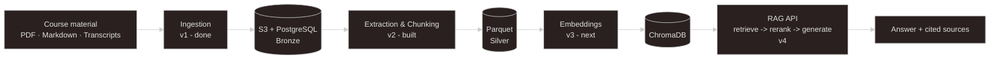

# project3-kms - A Knowledge Management System

**Status:** MVP v1 complete (tagged `v1.0.0`) · MVP v2 built and verified end-to-end · MVP v3 (embeddings) next

## 1. Problem & Approach

Data engineering students face scattered course material - unindexed slides, markdown repos, hours of video transcripts. Generic LLM tools hallucinate freely and have no awareness of a specific curriculum's actual content.

`project3-kms` is a Retrieval-Augmented Generation (RAG) knowledge system built over a real corpus - 745 PDF, markdown and transcript files across 13 course repositories from a data engineering program (STI, DE25) - organized through a **medallion-layered pipeline** (`Bronze` -> `Silver` -> `Gold`). **The design goal**: every answer traces back to its exact source chunk, not a plausible-sounding guess.

Built as a **thesis project**, staged across six MVPs. Ingestion and metadata are complete (MVP v1); extraction, chunking and Parquet-to-Silver are built and verified against the real corpus (MVP v2). Embeddings, a source-cited retrieve -> rerank -> generate API, a bounded self-correction loop and production deployment follow through MVP v6.

## 2. The Corpus, Measured

Every figure below was counted against disk and against the database, never estimated. The gaps between them are the interesting part.

| | |
|---|---|
| Supported files on disk (PDF + markdown/transcript) | **745** |
| Currently ingested | **473** |
| Rows in `documents` after content-hash dedup | **407** |
| Content duplicates collapsed | **66 (14.0 %)** |
| Unique PDFs among them | **94** -> 90 `EXTRACTED`, 4 `FAILED` |
| Full rebuild from an empty stack | **~28 s** (15.4 s ingestion + 12.2 s extraction) |
| Test suite | **46 unit tests**, 0 integration |

Three of those gaps are open work, stated here rather than hidden:

- **272 transcript files are not ingested yet.** They live in mirror folders whose names carry the course they belong to, while the ingestion path currently derives the course tag from the filename. Deriving it from the folder instead unlocks all 272 at once and costs no new mapping rules - the twelve folder names already match existing keys exactly.

- **The 14 % dedup rate is a provenance problem, not just a storage win.** A file reused across two courses collapses to one row with one `course_tag`, which is correct for storage and wrong for course-filtered retrieval. A `document_course` junction table has to land *before* anything is embedded - adding metadata after indexing means re-embedding everything.

- **The 4 failed PDFs were opened and looked at.** They are handwritten notes and text-stored-as-image: two distinct OCR problems, not one. The quieter failure matters more - a full slide deck that extracts to a single chunk is marked `EXTRACTED` with no error at all, and becomes a vector that promises more than it holds.

## 3. Tech Stack

| Layer | Built | Planned |
|---|---|---|
| **Ingestion** | `Python 3.12`, `boto3`, `SQLAlchemy 2.0`, `Alembic`, `psycopg3` | - |
| **Extraction** | `PyMuPDF`, `pymupdf4llm` | OCR fallback, table extraction, header/footer filtering |
| **Storage** | `PostgreSQL`, `LocalStack S3 (dev)`, `Parquet` via `pyarrow` | `ChromaDB (vectors)` |
| **AI layer** | - | `Grunden.ai` - `bge-m3` embeddings, `bge-reranker-v2-m3`, `glm-5.2` |
| **Serving** | - | `FastAPI` |
| **Orchestration** | - | `Airflow`, `dbt` + `DuckDB` |
| **Ops** | `Docker Compose`, `GitHub Actions CI`, `pytest` (44 unit), `Ruff` | integration tests, reverse proxy + `TLS`, `CD` |

## 4. Key Decisions

- **Course tags come from an explicit mapping, and an unknown repo crashes the run.** Three error types are handled differently on purpose: an unreadable file is skipped, a failed `S3` upload retries on the next run, and an unrecognised repo name stops everything. Inferring the tag with a regex would have been shorter and would have silently mislabelled hundreds of files the first time a repo was renamed.

- **S3 keys are namespaced as `{course_tag}/{repo_name}/{path}`.** Course repos reuse generic filenames (`README.md`, `slides.pdf`). Without the namespace, ingesting repo B would silently overwrite a same-named file from repo A - a failure mode caught at design time, not in production.

- **`Document.status` is a `VARCHAR` holding the enum name, not a native Postgres `ENUM`.** A native enum turns every new status value into a migration. The trade-off is written down because it has a sharp edge: SQLAlchemy persists the *name*, so `WHERE status = 'pending'` returns zero rows without an error - the column contains `'PENDING'`. Raw SQL and dbt models further down the pipeline have to match on the name.

- **A failed document gets a reason code on its own row - no crash, no dead-letter table.** Four codes separate "the PDF had no extractable text" from "it had text, below the threshold". The second answer means the document had content all along and the threshold is what's wrong. Naming the codes after what is actually broken, rather than after where the code noticed, is what makes them readable six months later.

- **Parquet is the source of truth for chunk text; the vector store is always a derivative.** ChromaDB can be dropped and rebuilt from Parquet and Postgres at any time, and never holds anything that exists nowhere else. `ChromaDB` over `Qdrant` for the same reason a corpus this size doesn't yet justify a dedicated vector service - `Qdrant` stays on the table if measured latency ever demands it.

- **Source citation is mandatory, not a feature toggle.** Every answer returns the exact chunk(s) it came from. Without that, the system is just another chatbot that sounds confident.

- **The eval-harness ships before the self-correction loop.** MVP v4's baseline gets measured against 40-60 question/source pairs before MVP v4.5 adds any self-correction - otherwise there is no way to tell whether the loop helps or just adds latency.

## 5. Quickstart

Requires [uv](https://docs.astral.sh/uv/) and Docker.

> **The course material is not redistributed and is not part of this repository.** The pipeline reads from a local `repos_for_data/` directory, which is gitignored. Cloning gives you the system, not the corpus.

**1. Clone and install**

`git clone https://github.com/JohnnyHyytiainen/project3-kms.git`  

`cd project3-kms`  

`uv sync`

**2. Configure environment**

`cp .env.example .env`

Fill in `DB_USER`, `DB_PASSWORD` and `DB_NAME`. `docker-compose.yml` reads the same three variables, so Postgres and the application cannot disagree about them. `AWS_*` and `GRUNDEN_API_KEY` can stay as placeholders - they are not validated until MVP v3/v4.

**3. Start infrastructure** (Postgres on `:5436`, LocalStack S3 on `:4566`)

`docker-compose up -d`

**4. Apply the database schema**

`uv run alembic upgrade head`

**5. Run ingestion, then extraction**

`uv run python -m kms.ingestion.ingest`  
`uv run python -m kms.extraction.extract`

> **The S3 bucket is empty after every LocalStack restart.** Persistence is a paid LocalStack feature, so the dev stack is treated as disposable on purpose: `repos_for_data/` is the only real source of truth, and Bronze is rebuilt from it. A full rebuild takes about 28 seconds - measured before the question of persistence was decided, and cheap enough to settle it.

## 6. Attribution

Course material used in this project - PDFs, markdown, and video transcripts - comes from the STI Data Engineering program (DE25) and is used **with written permission from the course instructors, obtained before ingestion began**. The material itself is not redistributed and is not part of this repository.

- **Debbie Lau** - [github.com/Db-Lau](https://github.com/Db-Lau)
- **Kokchun Giang** - [github.com/kokchun](https://github.com/kokchun)
- **Kristoffer Johansson** - [github.com/Krillinator](https://github.com/Krillinator) · [inspiira.se](https://inspiira.se/)

Courses developed and delivered via [AIgineerAB](https://github.com/AIgineerAB) - Debbie and Kokchun's company and by [Kristoffer Johansson](https://inspiira.se/)

## 7. License

MIT - see [LICENSE](https://github.com/JohnnyHyytiainen/project3-kms/blob/main/LICENSE).

## 8. Author

Johnny Hyytiäinen - [github.com/JohnnyHyytiainen](https://github.com/JohnnyHyytiainen) for portfolio, LinkedIn, and other projects.
