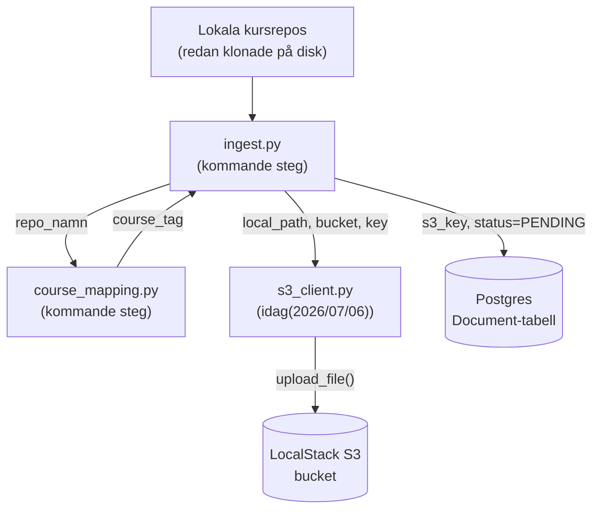

# Docs regarding S3 and LocalStack
Brief docs regarding S3 and LocalStack for my own purposes to deepen understanding regarding them before implementation

## Diagram: Where s3_client.py's respolsibility end

---

### 1. S3 (Simple Storage Service) Objektlagring vs Filsystem
Det första och absolut viktigaste steget för en Data Engineer när det gäller S3 är att byta mentalt paradigm. På min vanliga dator och i system som t.ex HDFS använder man ett **hierarkiskt filsystem**. Du har mappar, undermappar och filer.

S3 är **Object Storage (Objektlagring)**. Det är i grunden en platt struktur.
I S3 sparar man inte en "fil" utan man sparar ett **Objekt**. Ett objekt består av tre delar:

1. **Data:** Själva innehållet (En PDF eller t.ex ett `.md`-transkript)

2. **Metadata:** Information om datan (t.ex `Content-Type: application/pdf`, eller egna taggar jag sätter)

3. **Key (Nyckel):** Objektets unika identifierare.

### 2. Buckets och "Mapp-illusionen"

En **Bucket** är den absoluta rot-behållaren i S3. Tänk på den som en "gigantisk", platt hink där alla mina objekt ligger i.

För mitt ingestion steg kommer jag använda mig av name spaces, dvs: `{course_tag}/{repo_namn}/{relativ_sökväg}`. Eftersom att S3 *inte* har några mappar. Om jag laddar upp en fil och ger den nyckeln `data_engineering/lab1/schema.pdf`, så skapar inte S3 en mapp som heter `data_engineering` och en undermapp som heter `lab1`.

Hela strängen `"data_engineering/lab1/schema.pdf"` är helt enkelt bara objektets namn (Key). Att S3-konsoler och vissa bibliotek visar det som mappar är bara ett kosmetiskt gränssnitt för att göra det enklare för oss människor att läsa. Det är anledningen till varför S3 är så extremt skalbart för ett Bronze Layer - systemet behöver inte hålla reda på ett komplext filsystemsträd, det behöver bara slå upp en nyckel i en platt lista. Till skillnad från t.ex `PySparks`/`Sparks`/`DuckDB`'s `hive_partitioning` där verktygen läser från fysiska mappar.  

### 3. LocalStack – Din personliga moln-simulator
När jag bygger applikationer mot molnet (AWS) vill jag helst undvika att betala för bandbredd och lagring under utvecklingsfasen, och jag vill kunna jobba offline. Det är här **LocalStack** kommer in.

Om AWS S3 är ett gigantiskt, högsäkert varuhus i molnet, så är LocalStack en kartong i pojkrummet som är målad för att se exakt ut som varuhusets lastkaj.
När min Python kod (`boto3`) skickar ett anrop för att ladda upp en fil, pratar den med varuhusets "språk" (AWS API).

* **`endpoint_url`:** Normalt är `boto3` hårdkodad att skicka paketet till den riktiga AWS-adressen. Genom att sätta `endpoint_url=http://localhost:4566` ställer jag in min GPS så att paketet istället levereras till LocalStack-containern på min lokala maskin.

* **Dummy-nycklarna (`PLACEHOLDER_FOR_NOW`):** AWS API är stenhårt på säkerhet. Varje paket måste ha en kryptografisk signatur (SigV4). `boto3` vägrar skicka iväg paketet om den inte får papper och penna (Access Key och Secret Key) för att skriva under. LocalStack bryr sig egentligen inte om vem som har skrivit under, men *API-protokollet* kräver att en signatur finns på plats. Därför fyller jag i nästan vad jag vill där som placeholder values.

### 4. Varför S3 passar perfekt i MVP v1 (Bronze)

I min arkitektur är S3 mitt **Bronze Layer**. Hela poängen med Bronze är *Immutability* (oföränderlighet). Jag vill kunna dumpa raw data från flera repos exakt som den är, utan att manipulera den.
Om min extraction logik (PyMuPDF) i MVP v2 kraschar eller om jag senare inser att jag vill ändra chunking-storleken för ChromaDB senare, så behöver jag inte hämta allt från originalkällorna igen. Datan vilar säkert och oförändrat i min Bucket.

Genom att dessutom koppla detta till min postgres databas (där jag lagrar statusen `PENDING`) frikopplar jag lagringen av de tunga filerna (S3) från själva orkestrerings logiken (Postgres/Airflow). Det är ett mönster som följer bästa och högsta branschstandard.
