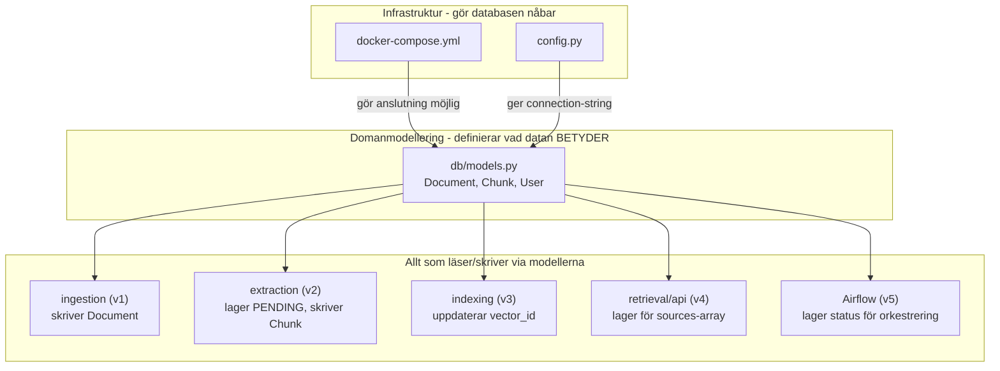

# Docs regarding kms/db/models.py script and alembic revisions
*written Friday 2026-07-03*
Nu när `Alembic-init` är klart är det dags att röra sig över till "kärnan" och skriva mitt `src/kms/db/models.py`-script.

`models.py` är i skrivande stund den mest *centrala* filen hittills, med *centrala* menar jag att nästan allt annat bygger på den filen. För att jämföra lite och vara tydligare.

* `docker-compose.yml` och `config.py` gör systemet körbart. `models.py` gör systemet *KORREKT* (Eller *FEL* om den designas fel från första början)
----

- **`docker-compose.yml`** gör `Postgres` *nåbar*. Det är infrastruktur, startar en process. Byter Jag från `LocalStack` till t.ex `Garage` imorgon rörs bara den filen.

- **`config.py`** vet *var* och *med vilka credentials*. Det är också bara ledning, ändrar jag `db_port` påverkas ingenting om hur `Document` och `Chunk` hänger ihop.

- **`alembic/env.py`** är ren rörmokeri åt `models.py`, `target_metadata = Base.metadata` är bokstavligen en pekare TILL den. `Alembic` har inget eget innehåll, bara ett verktyg som förverkligar det `models.py` säger.

**Vad** `models.py` gör rent praktiskt. models.py scriptet är det script som definierar *vad datan BETYDER* inte bara 'kan jag nå databasen' utan 'representerar databasen faktiskt problemet jag försöker lösa'. Infrastruktur som är fel gör att mitt system inte *STARTAR*, väldigt "högljutt" som jag märker av direkt. `Domänmodellering` som är fel gör att systemet kör på fint och tyst men räknar ut *helt FEL* saker, tyst. Jag märker inte det förens senare i projektet, långt efter att buggen först skrevs.

## Den delade tabellen är gränssnittet mellan delsystem som annars inte känner varandra

Det här är den delen som kopplar ihop allt till `architecture and system design`. Titta på hur `ingestion/`, `extraction/` (v2), `indexing/` (v3) och `retrieval/` (v4) är tänkta att fungera: de ska INTE anropa varandras funktioner direkt — det vore tight coupling, precis det jag redan medvetet undvikit genom att hålla `db/`, `storage/`, `ai/` separata från pipeline logiken. Istället pratar de med varandra *GENOM* tabellerna: `ingest.py` vet ingenting om hur extraction fungerar, den lämnar bara en `Document`-row med `status=PENDING`. Extraction vet *ingenting* om hur ingestion fungerar, den letar bara efter `PENDING`-rows. 

Det är precis det här mönstret som gör `Airflow`-orchestration i MVP v5 möjlig senare. en `DAG` kan fråga "vilka Document har `status=PENDING`?" utan att veta ett dugg om hur de blev `PENDING`. Utan `models.py` som gemensam, frågbar sanning finns det ingen plats att ställa den frågan.

