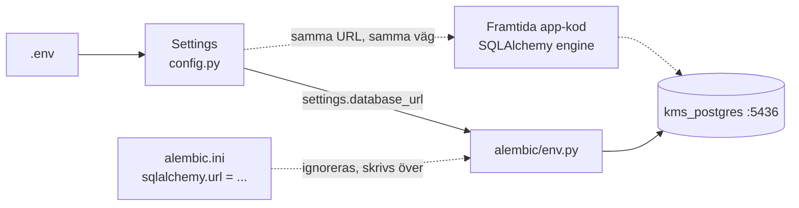

# Docs regarding src/kms/config.py script, alembic and DB revisions

- src/kms/`config.py` är en central config fil för KMS projektet, ALL läsning av miljövariabler sker i detta script. Alla andra moduler i projektet importerar sitt `settings`-objekt ifrån denna `config.py` fil istället för att anropa `os.environ` direkt. Det är samma `SSOT` princip som redan styr hur `.parquet`-filer och `PostgreSQL` delar 'sanning' i mitt kommande `chunk`-layer fast applicerad på konfiguration istället för på data.

*Se flowchart nedan för visuell förståelse kring hur flödet för just miljövariabler fungerar*

