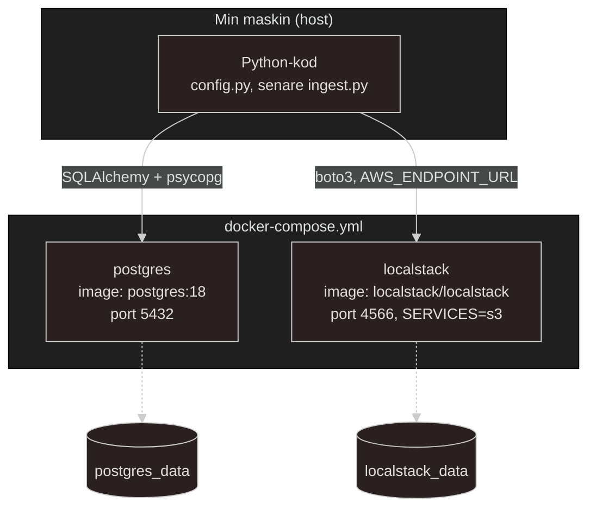

# Docs and theory regarding docker-compose.yml file.
I min compose kommer jag i MVP v1 att använda två tjänster. Två tjänster som är principiellt olika saker, inte bara "två containrar".

1) - **Postgres är INTE en emulator.** Det är samma databasmotor som kommer köra i produktion också, fast i mitt fall är det bara i en lokal container istället för en molntjänst. Inget beteende skiljer sig. `psycopg` pratar med den likadant oavsett om den körs i Docker på min lokala maskin eller som en hanterad tjänst senare.

2) - **LocalStack ÄR en emulator.** `AWS S3` går inte att ladda ner och köra lokalt, just för att det är en molntjänst, inte en mjukvara jag äger en kopia av. `LocalStack` låtsas prata `S3`s `API` tillräckligt bra för utveckling, utan `AWS`-konto eller kostnad. Det är därför Jag redan konstaterat att `LocalStack` är `dev/test`-only i nuvarande stadie, den ersätts av riktig S3 via en miljövariabel NÄR/OM går till prod, inte en kodändring.

Min `Python` kod kör på `host` (inte i en container än), matchar min "process regel": *"Skriv lokalt --> testa --> fungerar det, containerisera --> iterera."* Containerisering av själva applikationskoden är en senare iteration, inte MVP v1.
