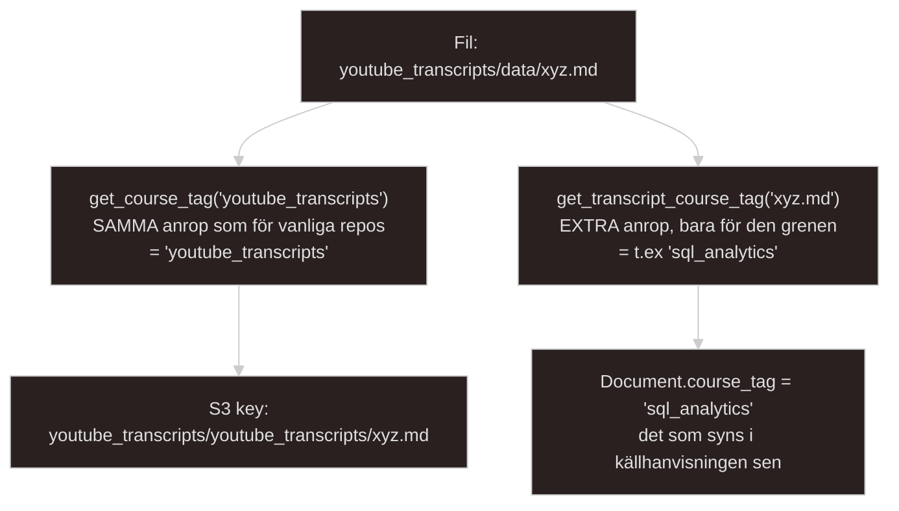
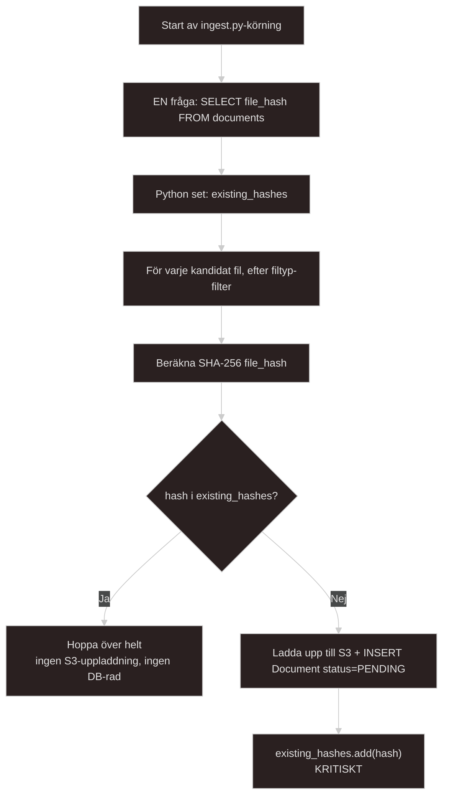
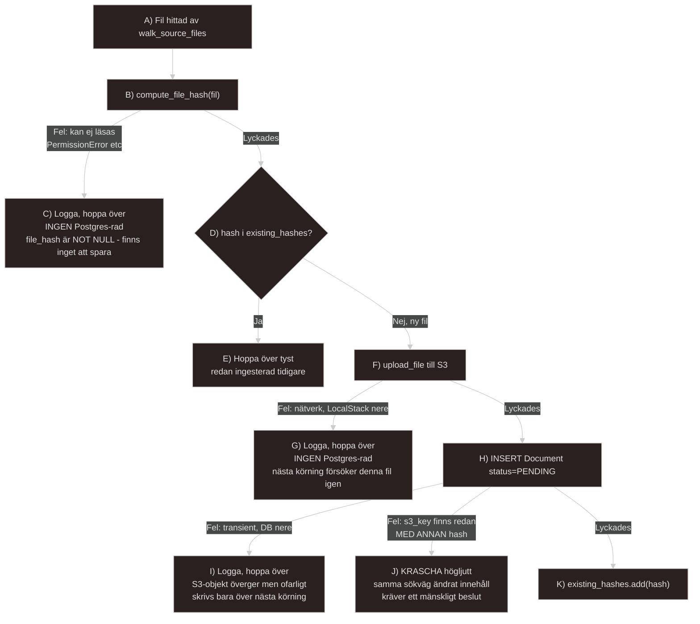
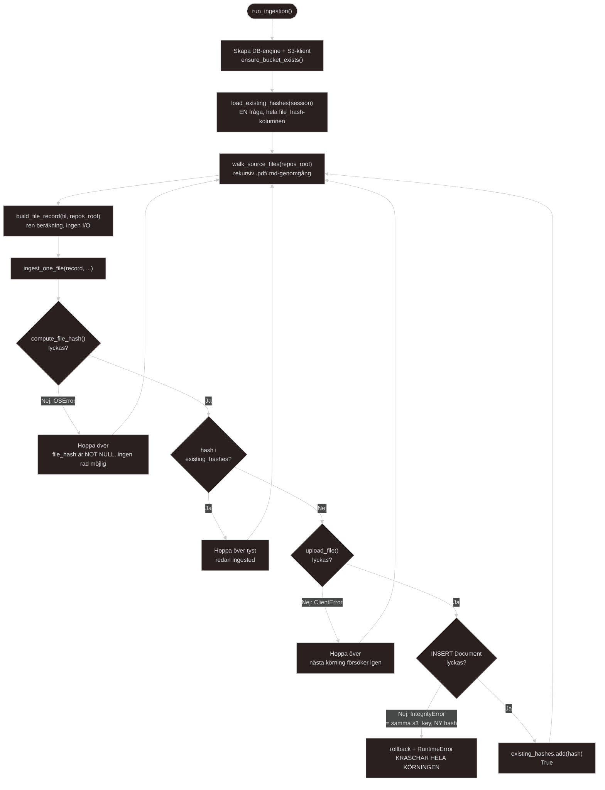

# Docs regarding my implementation and how I approach my data ingestion script
*Written 2026-07-08*

The most critical script for this entire project. What this script is intended to do is act as the first step directly after my source data. This script makes it possible for data to downstream to all my other modules. Without this script everything else collapses and will be useless.

To make it as easy and smooth as possible I updated my `.gitignore` to completly ignore `repos_for_data/` folder containing all 13x repos with data, this folder will be my SSOT for my data.
---

### Regarding my youtube transcripts and how I should try and navigate around it and my course tags

The idea I was guided towards is this this: If the outer loop of `ingest.py` iterates over all 14 top-level folders (13 repos + `youtube_transcripts`) and *always* calls `get_course_tag(folder_name)` to construct the first part of the `S3 key` completely and consistently, with no special handling required, then the `youtube_transcripts` entry is precisely what enables that uniform call without needing an `if`-statement. `get_transcript_course_tag(file_name)` is then executed in addition, *specifically* for the transcripts branch—writing a more granular, semantically accurate tag to the Postgres column.

This will create a genuine distinction between the `S3 key` (where the file actually resides) and `Document.course_tag` (what the file is actually about-semantics). It is a valid and logical separation, not a bug. The consequence is that the `S3 key` becomes somewhat repetitive for transcript files specifically `youtube_transcripts/youtube_transcripts/...` I will have to accept this for the sake of code consistency rather than implementing special handling to remove a duplicate string that no one but me will see in the `S3 console`.

### Deduplication and how I should handle it

Two points here that are worth to deeply understand here, rather than just accepting:

**Why load all hashes into a `set` once, instead of running one query per file?** With a couple of hundred candidate files, "one Postgres query per file" would work, but its just as wasteful as an `N+1` query problem, involving hundreds of network round-trips when a single one suffices. Furthermore, a `set` provides `O(1)` membership checks instead of a linear scan. This follows the same pattern as `REPO_TO_COURSE_TAG`: static reference data loaded into memory ONCE, rather than querying the database for every file.

**Why must `existing_hashes` be updated *during* execution, rather than just being loaded once at the start?** If file A `pandas_and_duckdb.md` is processed and inserted into the database, and file B `pandas_and_duckdb (1).md`, with identical content appears later in the *same* run—neither `A` nor `B` existed in Postgres when the script started. Consequently, a one-time load would fail to recognize that `A` had already been handled. The step `existing_hashes.add(hash)` immediately following each successful insert is what actually captures the specific scenario identified by my observation regarding the `(1)` suffix for some files.

Using `file_hash` as a deduplication key relies on the same fundamental concept used by `Git` for `blobs`, `Docker` for image layers, the content *is* the identity, regardless of where the file happens to be located. Its a good concept to be able to name-drop in an interview or when defending my thesis. This will be **an accepted limitation for v0:** if a file changes at the SAME path (example, an instructor updates a PDF, resulting in the same `s3_key` but a new `file_hash`), an `INSERT` attempt would crash due to the `s3_key` unique constraint, there is no existing match in `existing_hashes` (because the hash is new), yet the row cannot be added because the key already exists. I will go the route of: letting it crash **loudly** for v0 (following the same "fail loud, not silent" philosophy already present in `course_mapping.py` regarding `KeyError`) rather than building update logic for a scenario that is unlikely to occur (the material is static once cloned, not a live sync)

---

## Hashing and how to think regarding it before implementing it in script form

`models.py` defines `file_hash: Mapped[str] = mapped_column(String(64), index=True)`. 
Worth pointing out is: **no `| None`, no `nullable=True`**. This means a `Document` row physically CANT exist without a hash. This forces a logical branch that isnt a matter of preference, but a consequence of the schema:

* **Three categories with THREE different answers:**

1. **Cannot even read the file** (C) -->  "exclude it". Literally no other option; there is no `file_hash` to save.

2. **Network/DB failure mid-process, transient** (G, I) --> "exclude it" for *this* run, but *not* permanently. Postgres is the source of truth for "is this done?", so the next run will see the missing hash and retry. This follows the same idempotency principle already used in `s3_client.py`'s `ensure_bucket_exists`.

3. **Same `s3_key` exists but with a DIFFERENT hash** (J) --> "status should be 'failed'", though actually, it should be even *stricter*: this should cause a *hard crash* rather than being silently logged as a FAILED entry. A teacher updating the same PDF in the same location represents a genuine, unexpected scenario that requires my attention and a decision (overwrite? versioning?), exactly the same "fail loud, not silent" philosophy already applied to the `KeyError` in `course_mapping.py`.

## The entire picture and entire flow of my ingest.py script
The entire flow step by step of my `src/kms/ingestion/ingest.py`-script.

`SQLAlchemy` 2.0+ uses `select()` as a standalone function, not `session.query()` as the older 1.x you might encounter in older tutorials or docs, this is important to recognize, but not to write since I am currently using the *2.x* version. 

`select(Document.file_hash)` fetches only ONE column, not the entire row since there is no reason to retrieve `filename` or `course_tag` when I only need to compare `hashes`.

`session.execute()` returns a `Result` object where each row is technically a `Row-tuple`. `.scalars()` unpacks each `Row` to just the value itself. `.all()` materializes the entire result into a list. Wrapping the whole thing in `set()` accomplishes two things at once. It both collapses `duplicates` (my pairs with `(1)`-suffixes have the SAME hash but DIFFERENT `s3_key` values) and provides `O(1)` membership checks instead of a linear scan, the same habit that led to `REPO_TO_COURSE_TAG` being a dict rather than a list.

