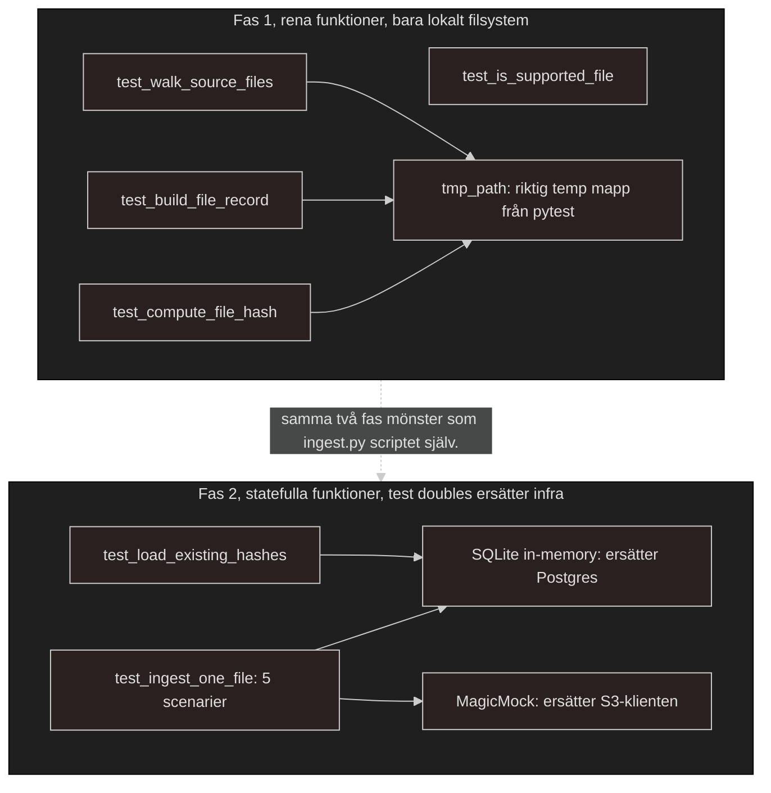
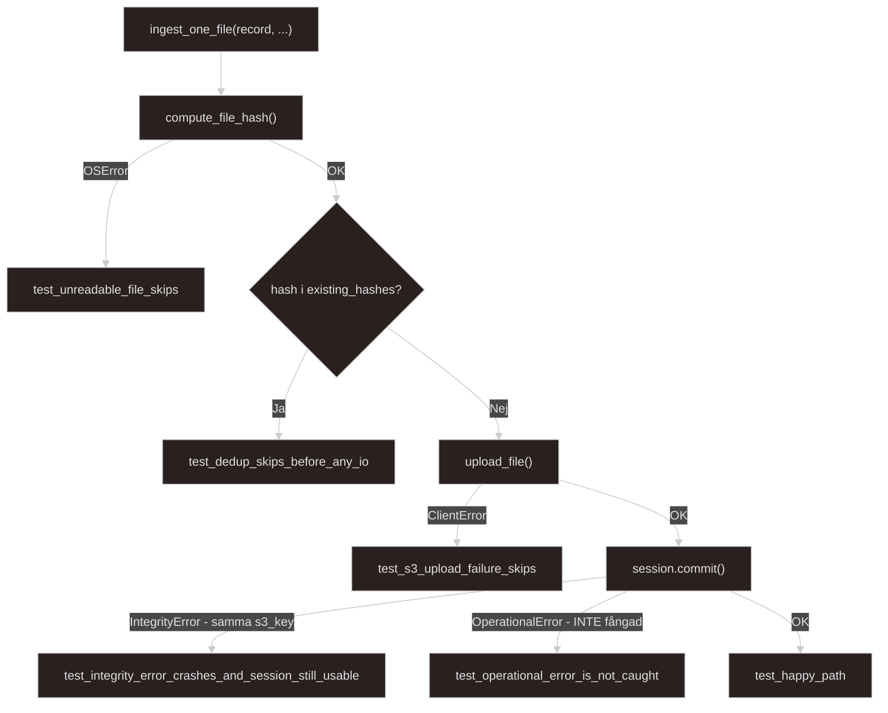

# Docs regarding testing of ingestion script and implementation in CI pipe
*Written 2026-07-09*

Reasoning behind building my first tests towards my ingestion script is because the ingest script is the closest script to my data source, it is about as far upstream one can come before getting in contact with the data itself.

### The 'testing pyramid'
The *testing pyramid* is a framework used in software development made to create a balanced mix of automated tests. Basically what that means is that it includes writing many small and fast tests at the bottom layer of the pyramid and slower tests the further up the pyramid you scale. This will save time and catch pesky bugs faster. If you think of the pyramid in three sections it could look something like this;

1) **Unit tests, the bottom of the pyramid**. Unit testing here are supposed to be fast and check the smallest parts of my code, individual functions, classes or methods in isolation. These tests are "supposed" to make up the majority of the tests and the cost of them is low in writing time and fixing time.

2) **Integration tests, the middle of the pyramid**. The integration tests are supposed to check how different parts/modules of my codebase works together. They are here to make sure all the pieces can talk to each other correctly before entering production. They make up the second biggest part of the pyramid, they take longer time to run compared to the unit tests but are the next step in testing.

3) **End-to-end(E2E) or UI tests, the top of the pyramid**. The E2E tests *verify* the entire platform/application. They are supposed to simulate a real user using your platform/app/product. These tests are slow and take the longest time to run and the cost for them are the most expensive and fragile. Lets say if a button might have changed position in the dashboard or in the UI they will break.
---

## Data testing pyramid
With these 3 steps above you have an entire testing pyramid from the software development perspective. There are several different types of testing pyramids. There is for example a data testing pyramid that is devided into 4 steps.

1) **Data Quality**. This bottom layer tests the accuracy and consistency of your data and make the foundation. These run against individual fields and values, they are fast and targeted and make up the LARGEST share of a test suite, when *ONE* fails you're supposed to know exactly which column or metric to investigate.

2) **Structural**. This second layer tests and checks the data schemas and tables. These tests operate at the `DATABASE`-level. A schema check examines for example an entire table at once, and *not* just a single column. The scope might be wide but these checks still stay cheap and fast to run(Thank the DB engine gods!) which is why they sit just above the most `granular` checks rather than higher up in the pyramid.

3) **Functional**. This third layer tests your business logic. These checks are meant to validate the data transformation logic and business rules. What that means is that they need to run against already processed data rather than `SSOT`/`Bronze`/`Raw data`. They take longer to set up and often requires more domain knowledge to write and to write well.

4) **ETL & Migration**. This top layer is supposed to test the entire pipeline from end-to-end. These tests span across multiple systems and validate the full movement of data from source to destination (From `SSOT raw data` all the way up to your aggregated and ready to use in the `serving layer`). These tests are the *most* resource intensive checks and are typically run after a load completes or during a migration project rather than on *every* pipeline run.

(Source; https://soda.io/blog/practical-guide-data-testing-methods-tools-best-practices)

---

## Building my own testing pyramid
I will first implement testing of my ingestion logic in this project and go the route of several fast and isolated tests, fewer and slower integration tests in the middle and a few E2E tests at the top since I have only implemented the first ingestion script in my pipeline. 

To do this i will replace real infrastructure with test doubles, a pattern im already familiar with without even knowing it. `LocalStack` **IS** a test double for `S3` but on an `infrastructure level`(An entirely faked service within a container). For my first testing(2026-07-09) I will use 2 variants/phases.

- Phase 1:  `SQLite in memory` will replace `Postgres`.
- Phase 2: `MagicMock` will replace my `S3`-client.

## Implementing the testing of phase 2 with MagicMock
- `MagicMock` is an object that accepts whatever methodcall is sent and only pretends to succeed without any configuration. This is why `s3_client = MagicMock()` is more than enough to test `happy path`/`dedupe`/`OSError`. It succeeds per default. To simulate an ERROR I will need to configure `.side_effect` on the SPECIFIC method I want to fail, in this case it will be `s3_client.upload_file.side_effect = ClientError(..)` and my mock should throw that exception instead next time it gets called.

For this test I will also use something I've never used before with `Pytest`, that is `monkeypatch` which is a fixture build in to `pytest` to temporarily switch a method on a real object(`session.commit`). It will get reset automatically after the test has been ran. I am only using it to trigger my `OperationalError-test` since `SQLite` cannot naturally produce a '`Postgres`' has died error so it has to be FORCED now.

---

### With this last implementation of tests
With these last implementation of tests in my testing suite I will have covered everything my `ingest.py` script covers. And more specifically, it completely covers everything written in my last flowchart in ##full overview section in my `ingestion_script_mvp_v1.md` document

## Full testing overview
