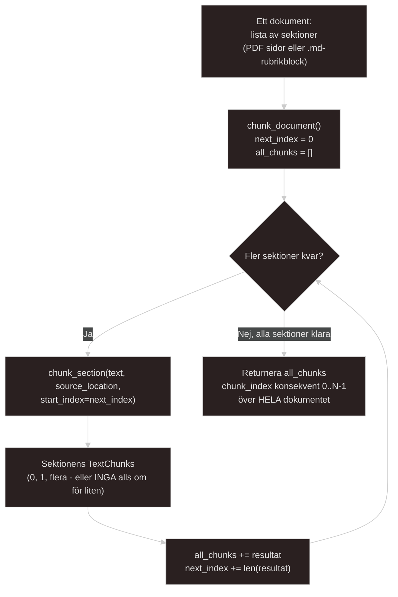

# Docs relating to chunking indexing.
De tester jag skrivit för testen av chunking och extraction logiken `tests/unit/test_extraction.py` använder min `chunk_section()`-funktion med dess default värde, som är 0. 

```python
def chunk_section(
    text: str, source_location: dict, start_index: int = 0
) -> list[TextChunk]:
```
Detta är korrekt, eftersom att mina tester enbart handlar om en isolerad sektion. MEN det är med mening att `def chunk_section()`-funktionen har ett default värde av 0. Det är menat att `chunk_document()` funktionen ska sätta hela den funktionen i arbete.

---

## Indexing of chunks and why it matters.

**Varför chunk_index är kritiskt:** Om jag har ett dokument med tio sektioner(kapitel). Sidnumren fortsätter rakt igenom hela dokumentet sektion 3 som handlar om X börjar inte om på sida 1 bara för att det är en ny sektion i dokumentet. Om det nu började om så skulle inte sidorna betyda något och vara helt onödiga för det skulle finnas tio olika sida 6, en per sektion(kapitel)

Just nu gör `chunk_section()` i `src/kms/extraction/chunker.py` ett korrekt jobb på EN sektion och ger tillbaka `chunk_index` som räknas från `start_index`. Om `chunk_document()` bara loopar och anropar `chunk_section()` en gång per sektion utan att skicka rätt `start_index` vidare så kommer jag åka på en huvudvärk till bug, dvs: sektion 1 ger `chunk 0, 1, 2`, Sektion 2 ger OCKSÅ `chunk 0, 1`. Det vill säga mitt `default`-värde igen. 

Två olika chunkar i samma dokument påstår sig båda vara `index 0` vilket inte är korrekt. Det här kommer i sin tur leda till att min databas inte kommer att protestera och säga att något har gått fel, det är en bug som liknar den bug jag precis har fixat med `duplicate chunken` jag upptäckte. Det innebär att jag inte kommer uppleva någon krasch, inga röda tester om mina tester inte specifikt letar efter just chunk index. Det leder i det långa loppet endast till ett tyst fel i ordningen den dagen jag har en retrieval-fråga som jag verkligen behöver kunna lita på.

- Lösningen på det "binära" med 0-1 i `chunk_section()` är snarlik den lösningen jag har i `ingest.py`-scriptet. I `ingest.py`så bär `run_ingestion()`-funktionen med sig min hash ifrån `load_existing_hashes()` mellan varje iteration vilket innebär att den uppdateras löpande under körning. Så att vid varv Z vet jag redan att varv A till Y redan är gjort och fångar duplicates inom en och samma körning. Det ska vara samma mönster mellan `chunk_section()` och `chunk_document()`-funktionerna. En ren och strikt "Gör den HÄR grejen"-funktion plus en loop runt om som bär med sig tillståndet mellan varje loop, allt som skiljer ska bara vara *VAD* den bär med sig. Istället för en lång hash som i `ingest.py` är det endast ett nummer här, hur många chunks som redan har skapats totalt i dokumentet.

---

## The mechanic behind indexing.
I varje varv så ska jag anropa `chunk_section(text, source_location, start_index = nästa_index)`, ta emot listan med `TextChunk` och appenda den i den växande TOTALA listan och räkna upp `nästa_index += len(den nya listan)` innan nästa sektion.

