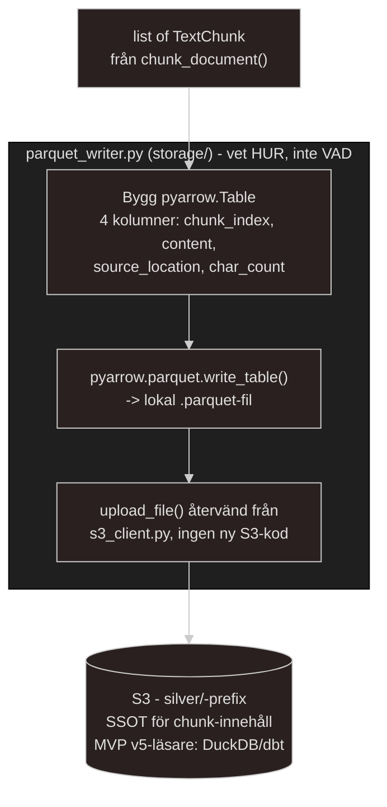

# Own docs regarding understanding + logic for parquet_writer.py script
*written 2026-07-25*

## What is parquet_writer.py supposed to do and what does it actually do?
Anledningen till att jag väljer .parquet-filformatet istället för t.ex csv, jsonl eller json(euuww...) är enkelt när man väl börjat förstå sig på "styrkan" i kolumnbaserad storage.

Istället för att läsa 1000, 10 000, 25 000 eller rättare sagt 100k `TextChunk` rader ifrån mitt `chunker.py`-script där varje rad ligger som ett sammanhängande block, alltså:
* ----> linjärt, rad efter rad efter rad med informationen
    * `chunk_index`, `content`, `source_location`, `char_count`

Om jag vill räkna ut ett snitt med min `char_count`(character count) över alla mina tusentals rader så kommer jag behöva parsa varje "block" av data var för sig, alltså `chunk_index`, `content`, `source_....`, för att till sist ta mig till `char_count`. Det låter kanske inte allt för krävande om man ser det så här. Men tittar man i `chunker.py`-scriptet ser man ganska så tydligt att `content` *KOMMER* innehålla 1500 tecken till mestadels, då EN `CHUNK` är 1.5k tecken. Det är otroligt krävande när jag endast vill få ut ett antal siffror som resterande av blocken innehåller. 

Genom den här logiken kommer jag alltså slösa bort otroligt mycket compute kraft för att få reda på några siffror. Vilket fungerar lokalt pga min dator är kraftfull men det spelar ingen roll, det som spelar roll är tankarna kring just overhead kostnad då system i produktion inte "körs lokalt på min dator". Det är kostnader som kan bli otroligt dyra, väldigt fort.

**HÄR** är styrkan i just columnar based storage AKA `.parquet`-filformatet. Här är varje "block" sin egen kolumn. Lagrad så här:  
| chunk_index | content | source_location | char_count |
|:--|:--|:--|:--|
| chunkens index nr | all content(1.5k chars) | dess location | character counten |
| etc | etc | etc | etc |

- Vill jag endast läsa informationen som `char_count` innehåller kan jag enkelt och SNABBT göra det, likadant med resterande kolumner. Extremt fort, extremt "snålt" + extremt små filer jämfört med vad de andra mer "linjära" filformaten är. `.parquet` innehåller även bättre metadata än resterande filformat för mitt ändamål, med `.parquet` filer så lagras även ett alldeles eget schema i footern(footern innehåller alltså metadatan) som är självbeskrivande, innehåller kolumnernas namn + vad för datatyper det är och varje kolumn blir komprimerad var för sig. Det är därför filerna är så förvirrande små vid första anblick.

---

### PyArrow and where it fits in.
- Vidare till `PyArrow`-dependency som jag behöver och kommer använda mig av. `PyArrows` roll i det hela blir:

    - 1) Arrangera mina Python objects, dvs listan av `TextChunk` i mitt `chunker.py` script till en egen `pyarrow.Table` som är `PyArrows` alldeles egna columnar baserade minnesrepresentation, det är liknande byte av 'form' som redan har skett i mitt `chunker.py`-script. Från att dela upp data till `Section` för att sen dela upp `section` till `TextChunk`. Det lägger enbart på ett extra steg i det ledet. Så nu går det från `Section` --> `TextChunk` --> `Table`.

    - 2) `pyarrow.parquet.write_table(table, lokal_path_på_datorn)` serialiserar den tabellen till en *riktig* `.parquet` fil på min disk.

