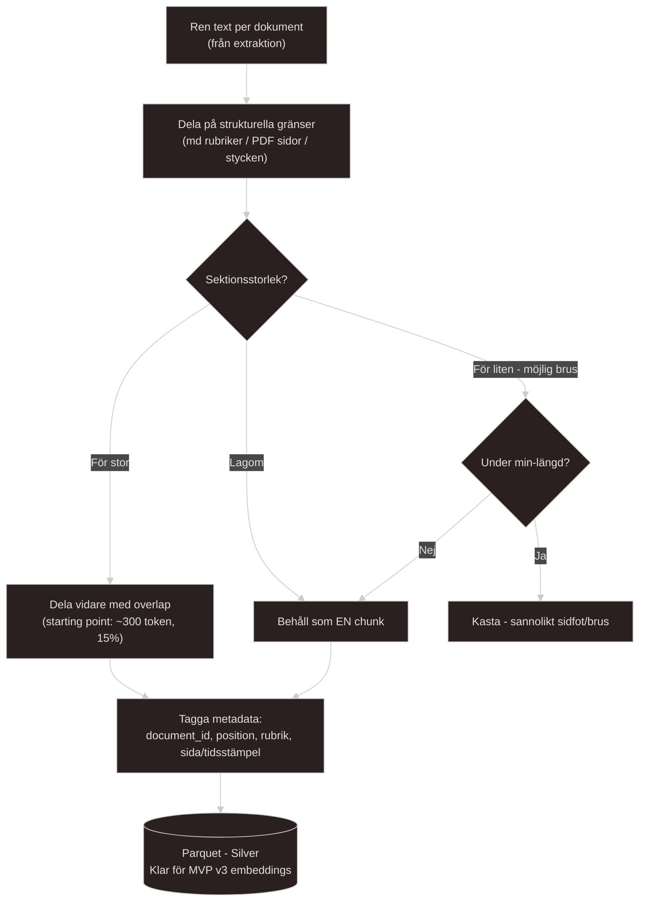
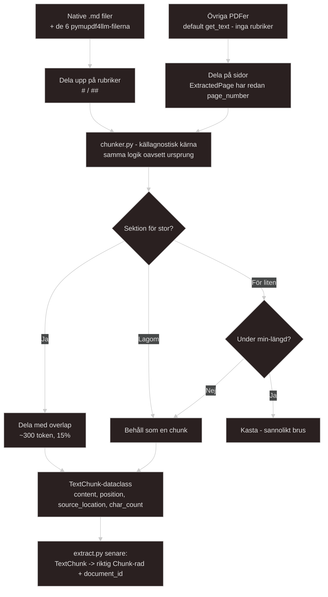

# Docs regarding PDF chunking using PyMuPDF deps
Chunking, grain och vad det innebär för mitt projekt (Med liknelser ifrån tidigare erfarenhet av ytbehandling av metall)

1. **För grovt grit (Grain = Hela PDF-dokumentet):**
Varje rad i databasen är en hel PDF på 40 sidor.
* *Användaren frågar:* "Hur fungerar en For-loop?"
* *AI'n hittar PDFen och säger:* "Det står någonstans i det här 40-sidors dokumentet. Lycka till." (diffust och saknar precision)

2. **För fint grit (Grain = En enda mening):**
Varje rad i databasen är exakt en mening.
* *Användaren frågar:* "Hur stänger jag av auto-commit?"
* *AI'n hittar meningen:* "Detta sätts till false som standard."
* AI'n har ingen aning om vad "Detta" syftar på, eftersom kontexten (meningen innan) slipades bort när jag använde för fint papper sista rundan av slipningen.

3. **Perfekt grit (Strukturmedveten Grain):**
Jag använder Markdown rubrikerna. En rad i databasen representerar *ett logiskt stycke under en specifik rubrik* (ca 200-500 ord).
* Då "fångar" jag både detaljen (finheten) *och* sammanhanget.

--- 

Om min grain är "Hela PDF'en" så kommer det sluta med att AI'n vet *att* svaret finns i *boken* men inte på vilken rad. Det är alldeles för `course-grained`, eller `high level`.

Om min grain är "Ett ord" så har ordet tappat hela sin mening och betydelse, det är bara ett ord för sig själv. Alldeles för `Fine-grained`

- Det jag behöver hitta är balans. "En hämtningsbar enhet av en mening". Någonstans mellan 200 till kanske 500-600 tokens(Cirka 150-400 ord). Men det jag även behöver tänka på är `overlapping`. Jag måste tänka på att inte strikt "kapa" av en mening i mitten, den meningen kan t.ex vara ett stycke kod som kapas på mitten och blir helt värdelös om det händer. Nästa `chunk` måste alltså kunna överlappa om en mening kapas i mitten så att `kontexten` överlever.

- För STOR `chunk` innebär att flera koncept blandas i en vector, embeddingen blir ett genomsnitt som inte matchar någon specifik fråga bra, för LITEN `chunk` innebär att kontexten går förlorad vid gränserna, fler vectors att lagra/söka igenom och mer "noise" i träfflistan. "The sweetspot" att hamna i är mellan 200-600 tokens med en 10-20% overlap. Det blir min startpunkt för testerna.

- Notera: `bge-m3`-embedding modellen jag tänker använda mig av ifrån `Grunden.ai` *kan* hantera upp till 8192 tokens i kontext vilket är ovanligt långt för en embeddingsmodell och jag kommer säkert inte att behöva så mycket tokens i mitt projekt.

---
### De tre nivåerna av chunking att ha koll på

* **Naiv (Köttkvarnen):** Klipper texten varje 400 ord. *Brutalt*. Klipper rakt av mitt i tabeller, mitt i kodblock och mitt i meningar. **(Dåligt)**

* **Strukturmedveten (Kirurgiskt och precist):** *<- Mitt mål i MVP v2!* Den letar efter Markdown rubriker (`#`, `##`) eller tomma rader och klipper där. Så här kan jag "respektera" textens naturliga leder och ben.

* **Semantisk (AI bedömaren/embedding baserat):** Använder AI för att läsa och förstå när ett ämne byts, och klipper där. (För dyrt och långsamt för MVP v2. Det här bör jag spara som framtida förbättring om så behövs.)

### Tre chunking problem i mitt kms projekt och lösningen på mina tre datakällor**

* **Markdown:** "Lättast". Leta bara efter `#` och kapa.

* **Transkript (YouTube):** Svårast. Finns inga rubriker. **Men**, om jag kan spara tidsstämpeln (ex. "14:32") som metadata, har jag plötsligt den mest exakta källhänvisningen av alla (Vilket finns i de transcript jag gått igenom, timestamp med [00:13:00]).

* **PDF:** Beroende av Extraktionen (Del 1). När jag använder `pymupdf4llm` förvandlas PDF'en till Markdown. Då kan jag använda *samma* "Strukturmedvetna" chunking kod för både mina PDF'er och Markdown.

---

### Chunking logik fast för dokument
