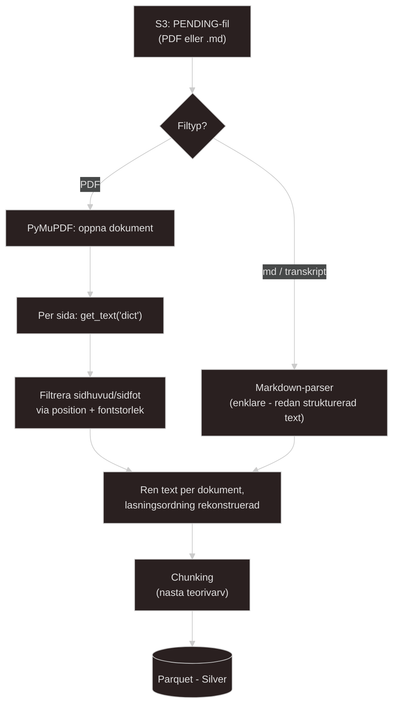

# Docs regarding PDF extraction
En PDF är inte ett dokument likt `.md`. En PDF är en utskrifts instruktion i grund och botten. Filen innehåller inte olika stycken som markdown gör utan en PDF innehåller en sekvens av 'ritkommandon', t.ex: "Placera tecken L vid koordinat (69, 696) i font 16pt", "placera tecken O vid koordinat (96, 800) i font 16pt" etc etc för att bygga ett ord. Det finns normalt ingen inbyggd information om att de tecken som är placerade i PDF'en bildar ordet LOL.

Läsordningen är alltså ingenting som `PyMuPDF` reconstruct'a genom att gissa sig fram utifrån X,Y positioner(koordinater) i vad ett mänskligt öga skulle läsa i vilken ordning. Det här är det mest *kritiska* steg att få rätt i hela *MVP v2*, likadant som att mitt `ingest.py`-script var den mest kritiska delen i *MVP v1*.

Jag kommer garanterat stöta på issues med extraction av PDF'erna i den här versionen av projektet. De problem jag kommer stöta på är: Sönderhackade texter, halva stycken kod som egentligen borde vara hela etc.

## Extraktionens egen "grund före glans".
Det är samma princip här som jag använder i majoriteten av mina andra projekt. Börja litet, säkerställ att det fungerar som tänkt, skala upp lite, testa, säkerställ att det fungerar, skala upp ... ... etc.

Stegen jag kan dela upp det i är dessa:

1) `page.get_text("text")` - Det här steget utgör grunden. Ren text, inbyggd men "naiv/blåögd" läsordnings-gissning. Det var detta min snabba `PoC` innan använde sig av och det räcker för enkla `one column PDFs`.

2) `page.get_text("text", sort=True)` - En snabb och billigare förbättring, här tvingar jag sortering top till botten och vänster till höger. Det här löser "lätt" kolumn oordning men *garanterar* inte att allt blir löst.

3) `page.get_text("dict")` - FULL struktur. `Blocks` -> `lines` -> `spans` med font, storlek *och* position per bit text. Här behöver jag *aktivt* skilja på rubrik från brödtext från sidfot baserat på fontstorlek och position och inte bara hoppas på att sorteringen *RÅKAR* bli rätt.

4) `pymupdf4llm.to_markdown()` - Det här är ett separat paket i `PyMuPDF` biblioteket(Samma licens). Det är byggt *SPECIFIKT* för mitt exakta problem här. `PDF` -> ren `Markdown` *med* lösordning och tabellstöd inbyggt. Det här löser multi-kolumn och tabellproblem automatiskt istället för att jag bygger en **egen** position/font-heuristik(tillvägagångsätt).

- Min tidigare och enkla `PoC` bevisade att *steg 1* fungerade. Här i `project3-kms` MVP v2 är mitt jobb att ta reda på VART på den här stegen ovan det riktiga kursmaterialet kräver att jag landar. Steg 1, 2, 3 eller 4.

## Edge cases att tänka på: 

* **Fälla 1 Föreläsningsslides:** ofta kort text per sida, punktlistor, ibland två kolumner. Kodsnuttar är antingen riktig text (monospace font, extraherbar) eller en skärmdump inbäddad som bild, det senare är extraherbart som en bild-referens och *inte* som text, och det är en tyst dataförlust jag aktivt behöver tänka på och leta efter.
    - **Förklaring:** Tänk att någon klistrar in en skärmdump av Visual Studio Code i sina slides. För det mänskliga ögat är det text. För PDFen är det bara en bildbox. `PyMuPDF` kommer hoppa över den helt. Detta är farligt för det är en tyst förlust, koden kraschar inte, men svaret försvinner.

* **Fälla 2 Kompendier:** mer linjär text (bra för mig), men kan ha fotnoter, tabeller, innehållsförteckning. Tabeller är notoriskt svåra - `PyMuPDF` extraherar dem ofta som lösryckta ord utan kolumnstruktur om du inte specifikt använder `page.find_tables()`.
    - **Förklaring:** Om det finns en tabell i kompendiet och jag *inte* använder `pymupdf4llm` eller speciell tabell-logik, kommer koden bara läsa alla ord som en enda lång mening utan radbrytningar.

* **Fälla 3 Sidhuvud/sidfot som upprepas på varje sida (kursnamn, sidnummer):** brus i *varje* chunk från den PDFen om det inte filtreras bort innan chunking - späder ut den semantiska signalen i precis den data du senare ska embedda.
    - **Förklaring:** Det här är den absolut viktigaste fällan att vara medveten om för just `RAG`! Om det står `"Data Engineering Kurs 2026 - Sida X"` längst ner på varje slide, kommer den texten hamna i *varje* chunk i min `vektordatabas`. När jag sen frågar AIn något om `"Data Engineering"`, kommer `vektordatabasen` få **panik** för **ALLA** `chunks` ser plötsligt hyper-relevanta ut, eftersom alla innehåller de orden. Det är är brus jag måste filtrera bort **innan** chunking.

* **Process och tankar:** Jag kommer vara tvungen att testa mig fram väldigt många gånger. Som tur är känner jag igen mönstret med `Nuke + rebuild + try again`. `ChromaDB` är ett reproducerbart lager och inte min `SSOT`/`Bronze`(Postgres + S3). Så länge extraction och chunking är deterministiska funktioner av det som redan ligger i `Bronze` så kan jag *alltid* nuka hela min VectorDB, göra min ändring och bygga upp igen utan att förlora mer än någon minut åt gången.

* **Var någonstans i pipelinen börjar och slutar extraktionen?**
* Extraktionen slutar när jag har ren och sammanhängande text per dokument. **INNAN** den delas in i bitar(chunks). Chunking är ett separat steg med alldeles egna avvägningar och edge cases att tänka på.

