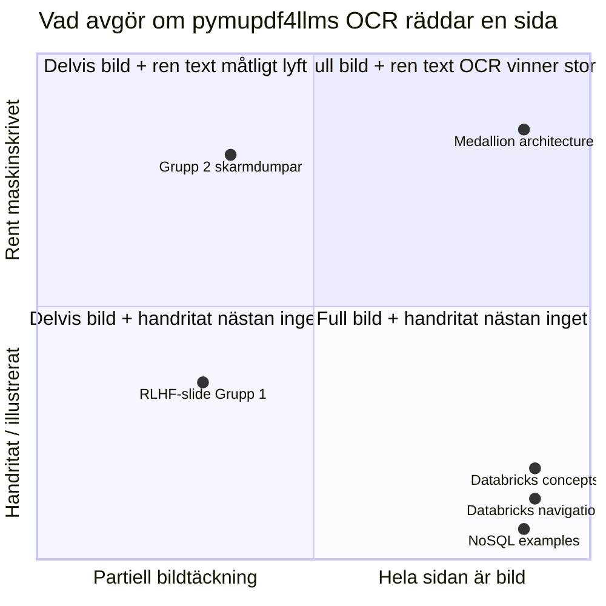

# Extraction problems regarding to PDFs
Vad som märks tydligt är svårigheten för `PyMuPDF` att kunna extrahera text ur PDF'er.

De områden jag söter på mest issues har att göra med `OCR(Optical Character Recognition)` och `PyMuPDF`s begränsningar att kunna tolka "bilder" med text i en PDF. För att hitta någon typ av balans utan att behöva förlita mig av extremt tunga deps(t.ex `MinerU`) har `pymupdf4llm` v1.28.0 `use_ocr=True` som default. Efter att ha testat att använda mig av det får jag bättre resultat i två "picture heavy" kategorier som jag valt att dela upp det i. Efter att ha testat mig fram visar det sig att skiljelinjen och där den *riktiga* gränsen går för maskinläsbara PDF'er verkar inte bara ha att göra med bilder med text i, det som spelar roll mer verkar vara just **innehållsSTIL**. Med det menar jag vad som är maskinskrivet vs handritat/illustrerat verkar den avgörande faktorn för om `pymupdf4llm`s `OCR default` kan läsa det eller inte.

- Output ifrån `experiment_pymupdf4llm.py`-scriptet:

|fil|                                                      sidor  |   före|    efter|   faktor|
|:--|:--|:--|:--|:---| 
|--- Grupp 2 --- | | | | |
|#0 Installation - PgAdmin with PostgreSQL.pdf              | 27   |  1420   |  2083    | 1.5x|
|#1 PyCharm - Importing Projects & Dependencies.pdf         | 18   |  1194   |  1521    | 1.3x|
|#5.5 Data Platform Development - Psycopg3, PostgreSQL &    | 61   |  2896   |  3773    | 1.3x|
|#6 Data Platform Development - ETL & ELT, Filetypes (CS    | 80   |  7933   | 10072    | 1.3x|
|#9 Data Platform Development - Lab Recap & Docker.pdf      | 79   |  7392   |  8871    | 1.2x|
|--- Grupp 3 --- | | | | | 
|slides_what_is_databricks.pdf                              |  7   |     0   |     0    | infx|
|slides_databricks_de_concepts.pdf                          | 11   |     0   |     2    | infx|
|NoSQL_examples.pdf                                         |  5   |     0   |    10    | infx|

