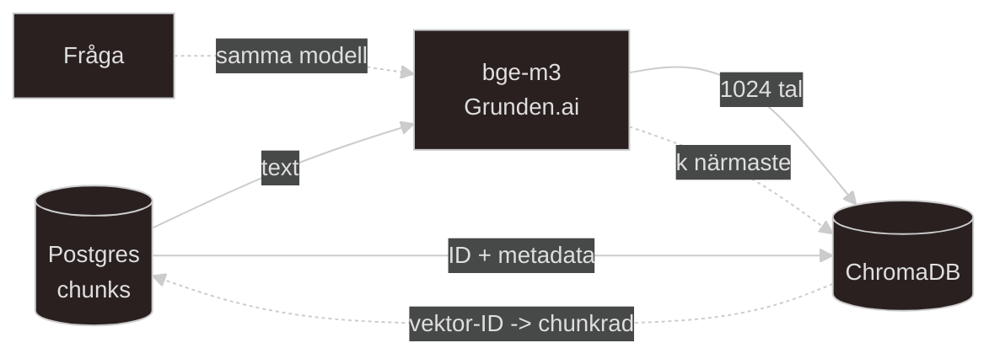

# Embeddings och vectordatabas

Översiktlig dokumentation kring embeddings, vektorer och vektordatabas.

---

### Embedding.
En *embedding* är en text omräknad till en lista med tal och det är här Grunden.ai's `bge-m3` ska in i projektet. `bge-m3`-modellen ska ge 1024 tal per text. Talen väljs så att texter som *betyder ungefär* samma sak får listor som ligger nära varandra. 

Likt koordinater i CAD. En punkt i en modell har tre koordinater(x,y,z) medan en embedding är en punkt med 1024 koordinater.

1. Embedding-modellen (`bge-m3`) och Vektordatabasen (`ChromaDB`)
    - Vad en embedding är i koden: Man skickar en textsträng (`str`) till modellen `bge-m3` via ett `API-anrop` och får tillbaka en `array` med exakt 1024 floats (`list[float]`, t.ex. `[0.021, -0.044, ...]`). Modellen är tränad så att textsträngar med liknande semantisk innebörd genererar talserier med liknande matematiska mönster, oavsett exakta ordval eller om texten är på svenska eller engelska.
    
    - Skillnaden mellan `Postgres` och `ChromaDB`:
        - `PostgreSQL` använder B-tree-index för exakt matchning och relationell logik (`WHERE course = 'SQL'`).
        - `ChromaDB` lagrar float-arrayer i ett grafbaserat vektorindex (HNSW) och är byggd för `ANN-sökning` (Approximate Nearest Neighbor). Den räknar ut det matematiska avståndet (oftast `Cosine Similarity`) mellan två arrayer.
        
    - Vad som sker vid en sökning (Query-time):
        - Användarens fråga skickas till `bge-m3` och omvandlas till en `1024-elements` list[float].
        - `ChromaDB` jämför frågans array mot alla lagrade chunk-arrayer och returnerar de `k` poster som har högst matematisk likhet (`Top-K`).
        
    - **Kritisk teknisk regel**: Både lagrade chunkar och inkommande användarfrågor måste processas av **exakt** samma modell (`bge-m3`). Olika modeller genererar helt olika numeriska skalor och dimensioner, man kan aldrig jämföra en vektor från modell A med en vektor från modell B.

--- 

### Schemat i ChromaDB och filtrering av metadata.
När man skriver en post till en `ChromaDB-collection` (`collection.add()` eller `collection.upsert()`) så lagras *fyra* komponenter per post:

1. `id (str)`: Unik primärnyckel i Chroma.

2. `embedding (list[float])`: Arrayen med 1024 flyttal.

3. `document (str)`: Själva råtexten för chunken.

4. `metadata (dict)`: Ett platt JSON/dict-objekt med attribut, t.ex. `{"courses": ["sql", "data_modeling"], "source_type": "pdf"}`.

- **Varför metadata måste med direkt vid skrivning:** 
    - `ChromaDB` kan inte göra en `JOIN` mot `PostgreSQL` under pågående vektorsökning. Om man vill göra en `pre-filtered` vector search (t.ex. "gör endast vektorsökning bland chunkar som tillhör SQL-kursen") måste den informationen finnas denormaliserad direkt i `Chromas metadata-dict`. Glömmer man ett fält nu måste jag antingen skriva ett migreringsscript eller köra om hela embedding-steget för att populera om metadatan.

- **Tekniska begränsningar i ChromaDB för listor:** Eftersom ett dokument kan tillhöra flera kurser (`M:N-relation`) behöver `"courses"` lagras som en `list[str]` i *metadatan* och filtreras med Chromas operator `$contains`. Den aktuella och nuvarande versionen av Chroma stödjer det här men har **TVÅ** hårda valideringskrav:
    1. Alla element i listan måste ha *exakt* samma datatyp (t.ex enbart `str`)
    2. Tomma listor (`[]`) är **FÖRBJUDNA** och kastar direkt ett fel vid inskrivning. Om en `chunk` saknar kurskoppling så måste nyckeln antingen utelämnas eller ha ett fallback-value.

    * Note: Eftersom att tidigare versioner av `chromadb` saknade stöd för listor i metadata helt så *måste* jag låsa versionen nu i en enkel `requirements.txt` eller i min `pyproject.toml`

---

### Datakvalite i extraction steget (Sidantalsfrågan) och beslutet att avgöra.
* **Vad som har hänt:** Filen `slides_knn.pdf` är ett helt bildspel, men text extraktionen producerade bara *en enda* chunk och markerade ändå körningen som lyckad utan felmeddelanden (en klassisk silent failure, ofta för att slides består av bilder eller grafik utan läsbar text).

* **Varför det är ett problem:** Om jag skickar den enda chunken till `ChromaDB` ser dokumentet ut att vara indexerat och sökbart, trots att nästan allt innehåll från PDF-filen saknas.

* **Beslutet jag står inför och måste ta:** Ska jag bygga in en validering i extraction steget som läser av faktiskt sidantal (`page_count`) i PDF-filen och varnar/flaggar om förhållandet mellan antal sidor och antal skapade chunkar är orimligt lågt – innan jag börjar generera vektorer?

---

### Referensintegritet och Idempotens (chunks.vector_id) + konflikten att lösa och avgöra
* **Kopplingen mellan databaserna:** När `ChromaDB` hittar de *`k`* bästa vektorerna behöver min kod slå upp motsvarande rader i `PostgreSQL` för att hämta `filnamn`, `dokumenttitel` och `kursdata` till mina källhänvisningar. Kolumnen `chunks.vector_id` i `Postgres` fungerar som bryggan (`Foreign Key-relationen`) mellan `Postgres` och `ChromaDB`.

* **Deterministiska IDn (Idempotens):** Istället för att låta `Chroma` generera ett nytt slumpmässigt `UUID` vid varje körning beräknar jag `vektorns ID` deterministiskt utifrån datan i `Postgres` (t.ex utifrån `chunk_id` eller en `hash` av dokument + chunk-index). Kör jag då en `upsert` med samma `ID` uppdateras den befintliga posten i `ChromaDB` istället för att det skapas dubbletter.

* **Konflikten att lösa:** Eftersom att `rebuild.py` idag raderar och återskapar rader i `Postgres` (vilket kan ge nya `auto increment/serial IDn` om jag inte tänker på det nu och börjar styra dem) behöver jag bestämma *exakt* hur `vector_id` ska konstrueras och synkas.

---

### Isolerat integrationstest mot Grunden.ai API

* **Vad som ska göras:** Skriva ett minimalt testanrop i Python som hämtar `API`-nyckeln från `config.py`, skickar en enda teststräng till Grunden.ai's endpoint för `bge-m3` och inspekterar svaret.
    
* **Vad jag verifierar med det:** 
    * Att autentisering (authentication) och `payload`-format fungerar.
    * Att svaret faktiskt innehåller en lista med `1024 floats` (`len(response) == 1024`).
    * Hur lång svarstiden (latensen) är per anrop, vilket avgör om jag behöver skicka chunkar i batchar istället för en och en.

---

### Orkestrering och State-synkronisering i rebuild.py

* **Arkitekturprincip:** `PostgreSQL` är för tillfället min `Single Source of Truth` (SSOT - primärdata). `ChromaDB` är ett härlett läs-index (derived data) som alltid byggs utifrån det som ligger i Postgres.
    
    * **Vad som ändras i `rebuild.py` scriptet:**
        * **Idag:** 1. Töm `Postgres-tabeller` $\rightarrow$ 2. `Ingestion` $\rightarrow$ 3. `Extraktion & Chunking`.

    * **Nytt flöde:** 
        * 1) **Reset:** Töm `Postgres`-tabellerna och radera/töm `ChromaDB`-collectionen i samma steg. Om jag bara tömmer `Postgres` ligger det kvar gamla vektorer i `ChromaDB` vars `IDn` pekar på rader som inte längre existerar (`orphaned records`).

        * 2) **Ingestion**

        * 3) **Extraction & chunking**

        * 4) **Embedding:** Läs ut `chunk-text` + `kurs-metadata` från `Postgres`, anropa `bge-m3`, skriv `vektor` + `metadata` till `ChromaDB` och säkerställ att `chunks.vector_id` matchar.

---

### Sammanfattning

* **Write-pipeline (Batch i `rebuild.py`):**

    1) Läs `chunk_text`, `id` och `kurs-metadata` från `Postgres` (`chunks`).

    2) Skicka `chunk_tex`t till `Grunden.ai` (`bge-m3`) $\rightarrow$ få tillbaka `list[float]` (1024 tal).

    3) Skriv `id`, `list[float]`, `chunk_text` och `metadata-dict` till `ChromaDB`.
    
* **Read-pipeline (Vid sökning i appen):**

    1) Skicka användarens frågesträng till `Grunden.ai` (`bge-m3`) $\rightarrow$ få tillbaka `list[float]` (1024 tal).

    2) Skicka fråge-arrayen (+ eventuellt `metadata`-filter för kurs) till `ChromaDB` $\rightarrow$ få tillbaka Top-*`K`* träffar med deras `vector_id`.

    3) Gör en `SELECT ... JOIN` i `Postgres` med hjälp av dessa `vector_id` för att hämta fullständig dokument och källinformation.

---

### Flowchart:
- Streckad linje visar en sökning (Search path)
- Heldragen linje visar skrivningen (Write path)
